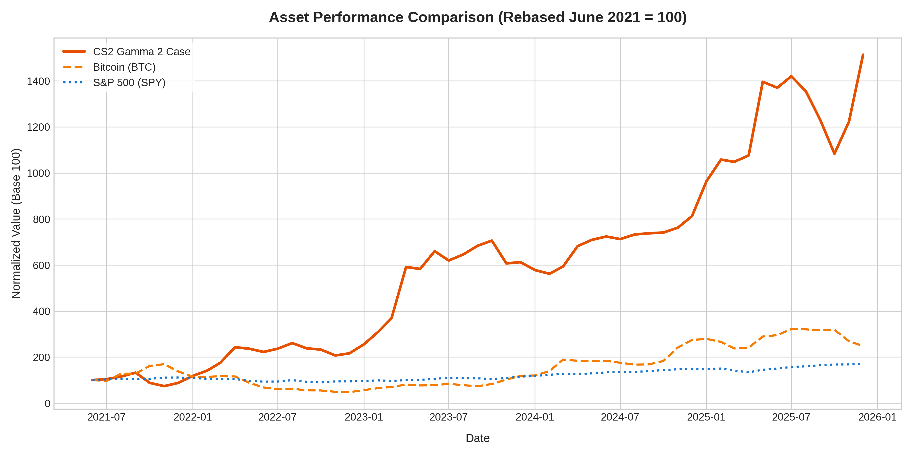

<div align="center">

# 📈 Quantitative Financial Analysis: CS2 Assets vs. Bitcoin & S&P 500


</div>

---

## 📌 Executive Summary
This case study evaluates the historical risk, return, and price-volume dynamics of three distinct asset classes under a unified time horizon (2016–2025):
* **Traditional Financial Asset:** S&P 500 ETF (SPY)
* **Crypto Asset:** Bitcoin (BTC)
* **Alternative Digital Asset:** Counter-Strike 2 (CS2) Gamma 2 Case

The project explores how closed virtual market assets behave compared to regulated equities and decentralized cryptocurrencies when measured through standard quantitative financial metrics.

---

## 📊 Key Analytical Findings

| Asset | Total Return | Monthly Volatility | Asset Class / Characteristics |
| :--- | :---: | :---: | :--- |
| **CS2 Gamma 2 Case** | **+1,413.56%** | **22.63%** | Alternative Asset (Illiquid, closed economy, supply-capped) |
| **Bitcoin (BTC)** | **+148.09%** | **19.97%** | Cryptocurrency (High liquidity, 24/7 trading, global adoption) |
| **S&P 500 (SPY)** | **+70.86%** | **3.53%** | Traditional Equity (Regulated, highly liquid, low volatility) |

### Performance Visualization (Rebased June 2021 = 100)
> *Note: June 2021 marks the transition of the Gamma 2 Case into the "Rare Drop Pool", drastically reducing new supply.*



---

## 💡 Financial Insights & Market Dynamics

1. **Supply Shock & Price Inelasticity (CS2 Assets):**
   When the Gamma 2 Case moved to the rare drop pool in June 2021, incoming market supply dropped sharply while consumption (case openings) remained active. This created a structural supply deficit, driving exponential price growth (+1,413.5%) that decoupled from broader macroeconomic cycles.

2. **Risk vs. Return Tradeoff:**
   While the CS2 asset delivered extraordinary asymmetric upside, it exhibited higher monthly volatility (22.63%) compared to Bitcoin (19.97%). Furthermore, virtual assets carry platform lock-in risks (Steam Market fee friction of 15% and capital extraction constraints).

3. **Macro Correlation:**
   S&P 500 provided steady risk-adjusted capital preservation (3.53% monthly volatility), whereas CS2 market assets demonstrated near-zero correlation with traditional equity markets, offering potential idiosyncratic diversification benefits inside digital environments.

---

## 🛠️ Data Engineering & ETL Pipeline

* **SPY & BTC Data:** Extracted daily price history and volume using Python and the Yahoo Finance API (`yfinance`).
* **Steam Market Data:** Scraped historical price and transaction volume data from Steam Community Market API endpoints (`/market/pricehistory/`), handling custom date parsing, currency conversions (USD), and rate limiting.
* **Data Processing & Normalization:** Handled market schedule disparities (traditional stock markets operating ~252 days/year vs. 24/7 continuous trading in Crypto and Steam) using time-series resampling and monthly aggregation.

---

## 📂 Project Structure

```text
├── CS2_vs_BTC_SPY_Analysis.xlsx                # Multi-sheet dataset (SPY, BTC, CS2 Case)
├── CS2_vs_BTC_SPY_Analysis.ipynb               # Main analytical Jupyter Notebook
├── asset_performance_comparison.png            # Generated high-resolution output visualization
├── README.md                                   # Executive project documentation
├── Case Study - CS2 Assets vs BTC & SP500.pdf  # Final report
```

[](https://public.tableau.com/app/profile/sebasti.n.mirizio/viz/CS2CaseMarketAnalysis-Gamma2vsBTCvsSPY/CS2vsFinancialAssetsAnalysis)

👉 **[Ver Dashboard Interactivo en Tableau Public](https://public.tableau.com/app/profile/sebasti.n.mirizio/viz/CS2CaseMarketAnalysis-Gamma2vsBTCvsSPY/CS2vsFinancialAssetsAnalysis)**

## How to Run the Analysis

1. **Clone the repository:**
   ```bash
   git clone (https://github.com/miriziosebastian-cmyk/cs2-vs-crypto-spy-financial-analysis.git)
   ```
   Install dependencies:
   ```bash
   pip install pandas numpy matplotlib seaborn openpyxl
   ```
   Execute Analysis Notebook:
Open CS2_vs_BTC_SPY_Analysis.ipynb in Google Colab, VS Code, or Jupyter Notebook and run all cells.
